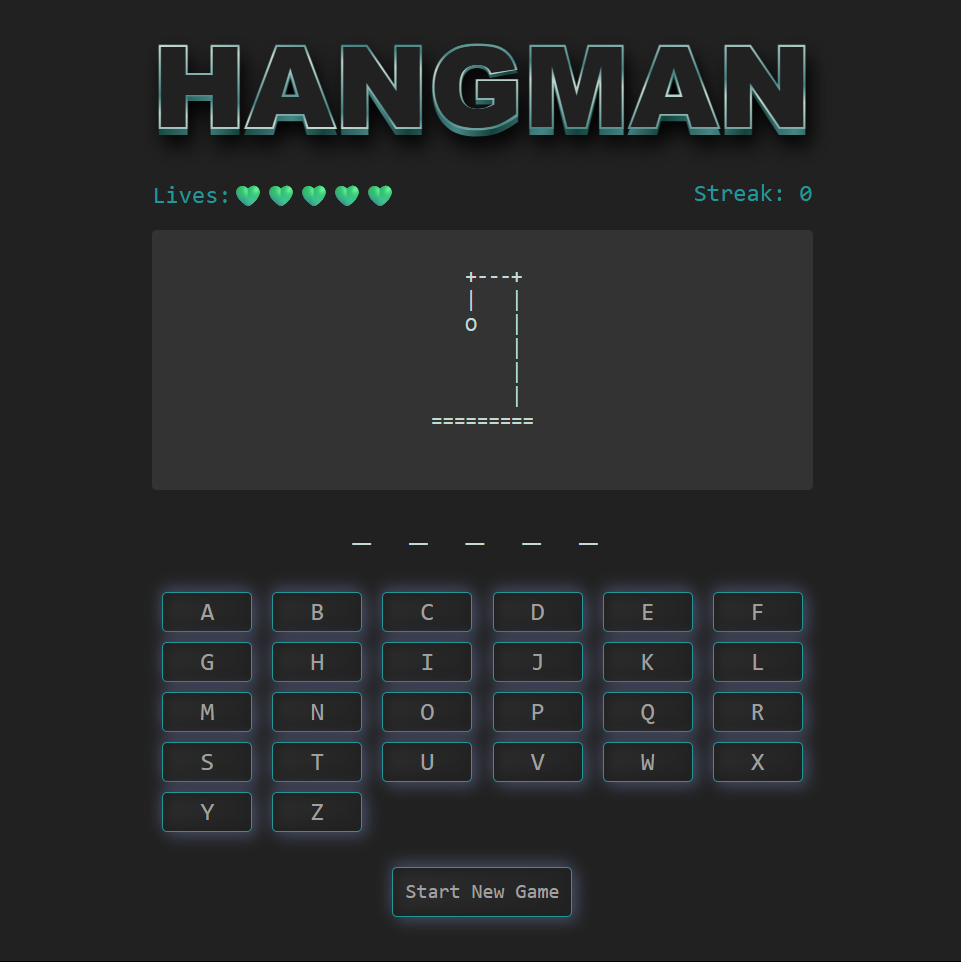

# 🎮 Hangman Game Website  

A fun and interactive **Hangman game** built with **HTML, CSS, and Python (Flask)**.  
The game has a **modern dark mode design**, is **fully responsive**, and works seamlessly on desktop and mobile.  
It’s hosted on **PythonAnywhere** so you can play it online anytime!  

## 🖼️ Screenshots



## ✨ Features  
- 🕹️ Classic Hangman gameplay with word guessing  
- ❤️ Tracks lives, streaks, and guessed letters  
- 🎨 Dark-themed, stylish UI with neon effects  
- 📱 Responsive design for mobile & desktop  
- ⚡ Lightweight and fast  

## 🛠️ Tech Stack  
- **Frontend:** HTML5, CSS3  
- **Backend:** Python (Flask)  
- **Hosting:** PythonAnywhere  

## 🚀 Getting Started  

### Prerequisites  
Make sure you have installed:  
- Python 3.x  
- Flask  

Install Flask with:  
```bash
pip install flask
```

### Run Locally  
Clone this repository  
```bash
git clone https://github.com/yourusername/hangman-game.git
cd hangman-game
```

Run the Flask server  
```bash
python app.py
```

Open your browser and go to:  
```
http://127.0.0.1:5000/
```

## 📸 Screenshots  
*(Add your game screenshots here to show the UI)*  

## 🌍 Live Demo  
👉 sadmansakib1.pythonanywhere.com

## 📂 Project Structure  
```
hangman-game/
│── app.py              # Flask backend
│── words.py            # Word list and game data
│── templates/
│   └── index.html      # Main game interface
│── static/
│   ├── style.css       # Game styling (dark mode, responsive)
│   └── script.js       # Game logic (if used)
└── README.md           # Project documentation
```

## 📜 License  
This project is licensed under the **MIT License** – feel free to use, modify, and share it.  
